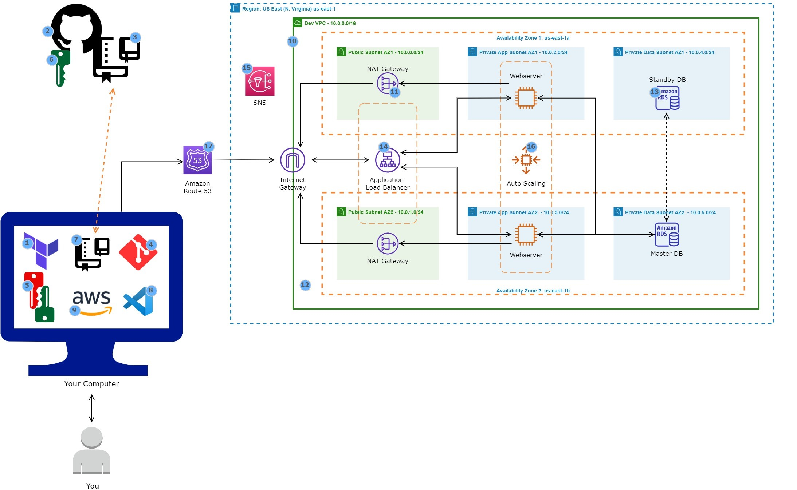

# Terraform Ecommerce 3 Tier Architecture Project

This project is a comprehensive DevOps initiative aimed at hosting a dynamic ecommerce web application on Amazon Web Services (AWS) with terraform. Below is an outline of the resources utilized along with a brief description of their roles in the deployment process.

## Resources Utilized

1. **Terraform**: Infrastructure as code tool that lets you define cloud resources in human-readable configuration files that you can version, reuse, and share.
2. **Git**: Employed for version control to track changes to source code and files.
3. **GitHub**: Used to manage Dockerfiles and application code in Git repositories.
4. **AWS CLI**: Enabled interaction with AWS services via the command line.
5. **Visual Studio Code (VS Code)**: Chosen as the integrated development environment for writing and editing scripts.
6. **3 Tier VPC (Virtual Private Cloud)**: Configured with public and private subnets across two availability zones.
7. **Internet Gateway**: Facilitated communications between VPC resources and the internet.
8. **NAT Gateway**: Enabled resources in private subnets to access the internet.
9. **Amazon RDS (Relational Database Service)**: Utilized for the relational database.
10. **Application Load Balancer**: Utilized for distributing web traffic to ECS Fargate tasks.
11. **Auto Scaling Group**: Dynamically created new ECS tasks as required.
12. **Route 53**: Registered domain names and created record sets for DNS management.
13. **Amazon S3**: Stored files and container environment variables.
14. **IAM Role**: Granted permissions for ECS to execute tasks.
15. **Security Groups**: Controlled inbound and outbound traffic to resources.
16. **Certificate Manager**: Employed for encrypting data in transit.
17. **SNS Topic**: Deployed to provide notifcations of AWS resources.

## Project Files
- **Deployment Scripts**: Available in the repository

## Contributing
Contributions to improve this project are welcome. Please submit a pull request.
